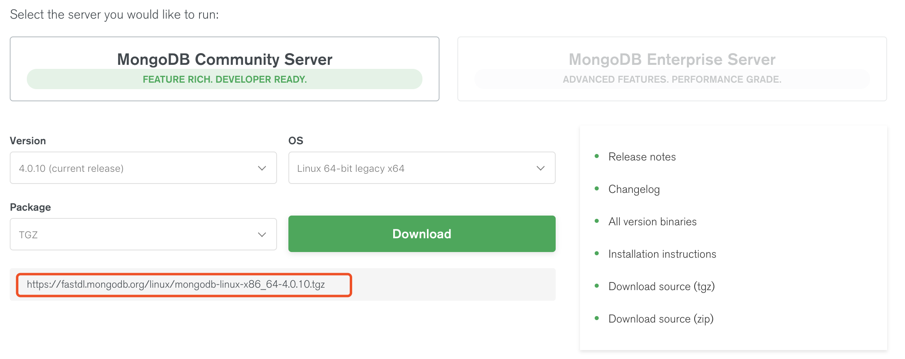

# 前言

在官网 [下载页面](https://www.mongodb.com/download-center) 选择 `Linux` 操作系统。注意，在 OS 选择中有多个基于 `Linux` 内核开发的版本，
包括 `Ubuntu`、`Debain` 等。这里下载通用的 Linux 加压版本，在每个分支的 Linux 中都会有专门的集成工具，类似于 Mac 的 `brew`。通过集成工具
可以很简单的进行安装使用，但是作为开发人员还是建议使用解压版本进行安装部署。



# 下载

在下载页面下方列出了下载链接，在 Linux 中我们可以直接使用 `wget` 和 `curl` 进行获取。笔者直接使用 `wget` 进行下载，下载目录为 `/usr/local`：

```bash
$ cd /usr/local/
$ sudo wget https://fastdl.mongodb.org/linux/mongodb-linux-x86_64-4.0.10.tgz
$ ls /usr/local/
mongodb-linux-x86_64-4.0.10.tgz  ...

# 解压
$ sudo tar -zxvf mongodb-linux-x86_64-4.0.10.tgz 

# 将解压后的文件夹重命名
$ sudo mv mongodb-linux-x86_64-4.0.10 mongodb
```

下载来看下 `MongoDB` 目录下有哪些文件：

```bash
$ ls /usr/local/mongodb
bin  LICENSE-Community.txt  MPL-2  README  THIRD-PARTY-NOTICES  THIRD-PARTY-NOTICES.gotools
```

其中 `bin` 目录下就是与 `mongodb` 有关的二进制可执行文件，看下有哪些文件：

```bash
$ ls /usr/local/mongodb/bin/

bsondump         mongo   mongodump    mongofiles   mongoreplay   mongos     mongotop
install_compass  mongod  mongoexport  mongoimport  mongorestore  mongostat
```

其他的先不说，暂时你只需要知道 `mongod` 是启动服务二进制可执行文件，`mongo` 则是客户端即可。

# 安装

接下来，在环境变量中配置 `MongoDB`，以便于在之后的任意目录执行 `MongoDB` 命令。

这里直接配置系统级别：`/etc/profile`，你也可以在 `~/.bash_profile` 中进行用户级别配置。

```bash
# 编辑配置文件
$ sudo vim /etc/profile

# 在配置文件中增加如下配置

# MongoDB
export MONGODB_HOME=/usr/local/mongodb

export PATH=$PATH:$MONGODB_HOME/bin
```

保存后使用如下命令使配置生效：

```bash
source /etc/profile
```

现在，输入如下命令验证是否配置成功：

```bash
$ mongod --version

# 如果输出如下信息即表示配置成功
db version v4.0.10
git version: c389e7f69f637f7a1ac3cc9fae843b635f20b766
allocator: tcmalloc
modules: none
build environment:
    distarch: x86_64
    target_arch: x86_64
```

`MongoDB` 的数据默认存储在 `data` 目录的 `db` 目录下（即 `/data/db`），但是这个目录在安装过程不会自动创建，所以你需要手动创建 `data` 目录，
并在 `data` 目录中创建 `db` 目录。

```bash
sudo mkdir -p /data/db
```

# 启动服务

到此，基本的已经配置完成了。现在在命令终端中输入 `mongod` 启动服务：

```bash
# 启动服务
$ mongod

# 如果没有配置环境变量需要先进入安装目录再执行服务启动命令
$ cd /usr/local/mongodb/bin
$ ./mongod
```

启动日志输出如下：

```
$ mongod

# 日志信息
2019-07-20T16:35:08.771+0800 I CONTROL  [initandlisten] MongoDB starting : pid=18321 port=27017 dbpath=/data/db 64-bit host=localhost.localdomain
2019-07-20T16:35:08.771+0800 I CONTROL  [initandlisten] db version v4.0.10
2019-07-20T16:35:08.771+0800 I CONTROL  [initandlisten] git version: c389e7f69f637f7a1ac3cc9fae843b635f20b766
2019-07-20T16:35:08.771+0800 I CONTROL  [initandlisten] allocator: tcmalloc
2019-07-20T16:35:08.771+0800 I CONTROL  [initandlisten] modules: none
2019-07-20T16:35:08.771+0800 I CONTROL  [initandlisten] build environment:
2019-07-20T16:35:08.771+0800 I CONTROL  [initandlisten]     distarch: x86_64
2019-07-20T16:35:08.771+0800 I CONTROL  [initandlisten]     target_arch: x86_64
2019-07-20T16:35:08.771+0800 I CONTROL  [initandlisten] options: {}
2019-07-20T16:35:08.772+0800 I STORAGE  [initandlisten] wiredtiger_open config: create,cache_size=375M,session_max=20000,eviction=(threads_min=4,threads_max=4),config_base=false,statistics=(fast),log=(enabled=true,archive=true,path=journal,compressor=snappy),file_manager=(close_idle_time=100000),statistics_log=(wait=0),verbose=(recovery_progress),
2019-07-20T16:35:09.882+0800 I STORAGE  [initandlisten] WiredTiger message [1563611709:882745][18321:0x7f85749a1a40], txn-recover: Set global recovery timestamp: 0
```

默认情况下，`MongoDB` 是以非守护进程启动。意思就是如果推出日志输出（即 `Ctrl` + `C` 组合键）就会终止服务，想要再后台运行只需要在启动服务时增加
`--fork` 参数即可，示例如下：

```bash
$ mongod --fork --syslog

# 如果输出日下信息即表示启动成功
about to fork child process, waiting until server is ready for connections.
forked process: 18358
child process started successfully, parent exiting
```

**注意：** 如果在启动服务时仅仅使用 `--fork` 参数是无法启动服务的，错误信息如下：

```bash
$ mongod --fork

# 错误信息
BadValue: --fork has to be used with --logpath or --syslog
```

由于要求以守护进行启动，我们必须指定日志的输出信息。不然日出输出到哪啊？其中 `--logpath` 是指定日志文件地址，如 `/logs/mongodb/db.log`。而
`--syslog` 是指定使用系统输出日志，注意两个日志参数不能同时使用！
