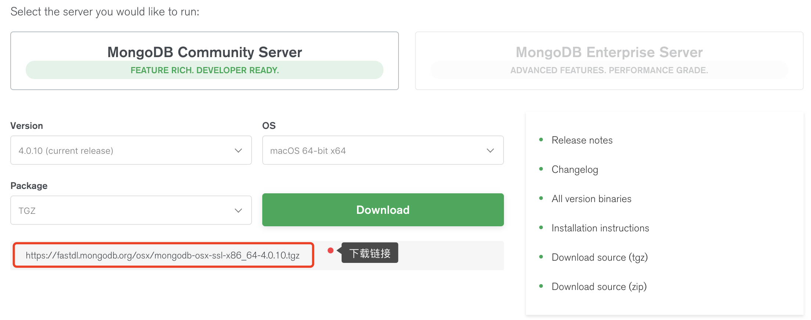

# 前言

在官网 [下载页面](https://www.mongodb.com/download-center) 选择 MacOS 操作系统，官网提供的是解压版本而不是压缩版本，选择对应的版本号后
点击点在即可，另外如果你不想使用浏览器进行下载你也可以通过下面标注的下载链接进行下载。



这里笔者下载 `v4.0` 版本，下载链接为：

```
https://fastdl.mongodb.org/osx/mongodb-osx-ssl-x86_64-4.0.10.tgz
```

# 下载

笔者直接根据上面的下载链接使用命令下载，下载目录为 `/usr/local`，命令如下：

```bash
$ cd /usr/local

# 下载
$ sudo curl -O https://fastdl.mongodb.org/osx/mongodb-osx-ssl-x86_64-4.0.10.tgz

$ ls /usr/local/
mongodb-osx-ssl-x86_64-4.0.10.tgz

# 解压
$ sudo tar -zxvf https://fastdl.mongodb.org/osx/mongodb-osx-ssl-x86_64-4.0.10.tgz

# 重命名为 mongodb 目录
$ sudo mv mongodb-osx-x86_64-4.0.10/ mongodb
```

如果你是直接使用浏览器下载压缩包，你将该压缩包放置在 `/usr/local/` 目录下即可，当然这个目录是随意的。

# 安装

压缩包解压完成后看下 `mongodb` 文件夹下有哪些文件：

```bash
$ ls /usr/local/mongodb
LICENSE-Community.txt		README				THIRD-PARTY-NOTICES.gotools
MPL-2				THIRD-PARTY-NOTICES		bin
```

其中 `bin` 目录下即是与 `MongoDB` 有关的二进制可执行文件，该目录下有如下可执行文件：

```
bsondump	mongo		mongod.conf	mongoexport	mongoimport	mongorestore	mongostat
install_compass	mongod		mongodump	mongofiles	mongoreplay	mongos		mongotop
```

其他的先不说，暂时你只需要知道 `mongod` 是启动服务二进制可执行文件，`mongo` 则是客户端即可。

现在，在环境变量中配置 `MongoDB`，以便于在之后的任意目录执行 `MongoDB` 命令。

这里直接配置用户级别：`~/.bash_profile`，你也可以在 `/etc/profile` 中进行全局配置。

```bash
$ vim ~/.bash_profile 

# 在 .bash_profile 配置文件中增加环境变量

# MongoDB
MONGODB_HOME=/usr/local/mongodb

PATH=/usr/local/bin:$PATH:$MONGODB_HOME/bin
export PATH
```

最后执行如下命令使配置生效：

```bash
$ source ~/.bash_profile
```

如果你要配置系统级别在修改 `/etc/profile` 文件时需要使用 `sudo` 超级管理员权限：

```bash
$ sudo vim /etc/profile
```

# 验证与启动服务

配置生效之后即可输入如下命令进行验证 `MongoDB` 版本信息：

```bash
$ mongod --version

db version v4.0.10
git version: c389e7f69f637f7a1ac3cc9fae843b635f20b766
allocator: system
modules: none
build environment:
    distarch: x86_64
    target_arch: x86_64
```

输出该信息即表示配置完成了，下面来启动 `MongoDB` 服务。

`MongoDB` 的默认数据存储目录为：`/data/db`，所以需要先创建该文件夹再启动服务：

```bash
$ sudo mkdir -p /data/db

# 启动 mongodb, 默认数据库目录即为 /data/db
$ sudo mongod

# 如果没有创建全局路径 PATH, 需要进入以下目录
$ cd /usr/local/mongodb/bin
$ sudo ./mongod
```

再打开一个终端进入执行以下命令：

```bash
# 如果没有配置 PATH 需要先进入 /usr/local/mongodb/bin  目录
$ mongo

MongoDB shell version v4.0.10
connecting to: mongodb://127.0.0.1:27017/?gssapiServiceName=mongodb
Implicit session: session { "id" : UUID("3c12bf4f-695c-48b2-b160-8420110ccdcf") }
MongoDB server version: 4.0.9
……
> 1 + 1
2
> 
```

注意：如果你的数据库目录不是 `/data/db`，可以通过 `--dbpath` 来指定。示例如下：

```bash
$ sudo mongod --dbpath=/data/db 
```

这是最基本的配置，后面会介绍如何使用配置文件启动服务，以及设置默认启动端口及数据存储目录等。

# 扩展

前面介绍的是使用压缩版的配置方式，当然也是推荐的方式。如果你觉得麻烦则可以直接使用 `brew` 进行安装：

```bash
# 安装 brew, 如果已经有的话饥饿不需要安装了
$ sudo brew install mongodb

# 如果要安装支持 TLS/SSL 命令如下
$ sudo brew install mongodb --with-openssl

# 安装最新开发版本
$ sudo brew install mongodb --devel
```

这中安装方式虽然简单但不是推荐的安装方式，建议还是使用解压版安装。