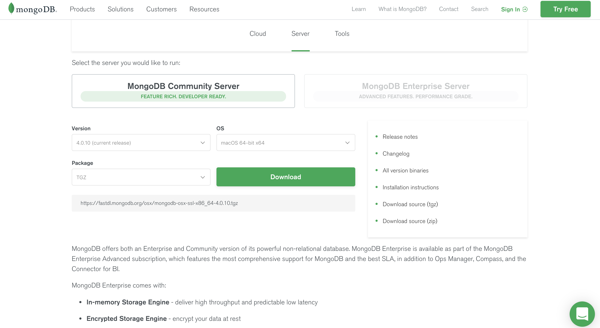

# 前言

`MongoDB` [官网](https://www.mongodb.com/) 提供了多系统版本，你可以在 [下载页面](https://www.mongodb.com/download-center/community)
选择对应的操作系统及版本。

如果你不知道该如何下载你可以跟随下面步骤进行下载

首先进入[官网](https://www.mongodb.com/)页面

在官网页面点击 [Try Free](https://www.mongodb.com/download-center) 按钮，即可进入下载页面

在下载页面选择 `Serer` 即可选择需要对应的版本信息。

下面就来看下如何安装